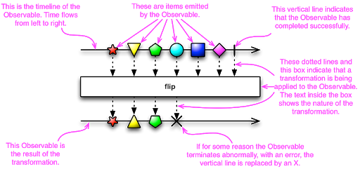

# Reactive Programming.

## Contents at a Glance.
* [About.](#about)
* [Documentation.](#documentation)
* [Reactor Patterns.](https://github.com/descriptions-of-it-technologies/software-design-principles-and-patterns/blob/master/reactor-patterns.md)  
* [Multi Reactor Patterns.](https://github.com/descriptions-of-it-technologies/software-design-principles-and-patterns/blob/master/multi-reactor-patterns.md)
* [Reactive Systems.](https://github.com/descriptions-of-it-technologies/reactive-systems)
* [Reactive Streams.](https://github.com/descriptions-of-it-technologies/reactive-streams)  
* [Articles.](#articles)
* [Conferences.](#conferences)
* [Conference Speakers.](#conference-speakers)
* [Help.](#help)

## About.

## Documentation.

## Reactive Programming
* Reactive Programming is an asynchronous programming paradigm focused on streams of data.
* “Reactive programs also maintain a continuous interaction with their environment, but at a speed which is determined 
  by the environment, not the program itself. Interactive programs work at their own pace and mostly deal with 
  communication, while reactive programs only work in response to external demands and mostly deal with accurate 
  interrupt handling. Real-time programs are usually reactive.”
  Gerad Berry, French Computer Scientist
* A means of reacting to changes and events. Spreadsheet programs are a great example of reactive programming: when cell
  data hanges, cells having formulas depending on affected cells are recomputed automatically. Later in this book you
  will seeRxJava, a popular reactive extensions API for Java that greatly helps coordinate asynchronous event and
  data processing. There is also functional reactive programming.
* Reactive programming is programming with asynchronous data streaming.

## Common Use Cases
* External Service Calls
* Highly Concurrent Message Consumers
* Spreadsheets
* Abstraction Over Asynchronous Processing
  * Abstract whether or not your program is synchronous or asynchronous

## Features of Reactive Programming
* Data Streams
* Asynchronous
* Non-blocking
* Backpressure
* Failures as Messages

## Data Streams
* Data Streams can be just about anything.
* Mouse clicks, or other user interactions.
* JMS Messages, RESTful Service calls, Twitter feed, Stock Trades, list of data from a database.
* A Stream is a sequence of events ordered in time.
* Events you want to listen to.

## Asynchronous
* Events are captured asynchronously.
* A function is defined to execute when an event is emitted.
* Another function is defined if an error is emitted.
* Another function is defined when complete is emitted.

## GoF Observer Pattern.

## ReactiveX Observable.

## Non-Blocking
* The concept of using non-blocking is important.
* In Blocking, the code will stop and wait for more data(ie reading from disk, network, etc)
* Non-blocking in contrast, will process available data, ask to be notified when more is available, then continue. 
* The concept of using non-blocking is important.
* In Blocking, the code will stop and wait for more data(ie reading from disk, network, etc)
* Non-blocking in contrast, will process available data, ask to be notified when more is available, then continue.

## Back Pressure
* The ability of the subscriber to throttle data.

## Failures as Messages
* Exceptions are not thrown in a traditional sense.
  * Would break processing of stream.
* Exceptions are processed by a handler function.

## Key Take Aways
* Reactive Programming focuses on processing streams of data.
* Traditional CRUD applications are still alive and well.

## Reactive
* Reactive Systems - Architecture and Design
  * ie Cloud Native
    
* Reactive Programming
  * Generally Event Based
    
* Functional Reactive Programming (FRP)
  * Often confused with Reactive Programming
    

## Reactive Programming with Reactive Systems
* Reactive Programming is a useful implementation technique.
* Reactive Programming focuses on non-blocking, asynchronous execution - a key characteristic of Reactive Systems.
* Reactive Programming is just one tool in building Reactive Systems.

## Articles.

## Conferences.

## Conference Speakers.

## Sources.
* [Spring Framework 5: Beginner to Guru](https://www.udemy.com/course/spring-framework-5-beginner-to-guru/?utm_source=adwords&utm_medium=udemyads&utm_campaign=SpringFramework_v.PROF_la.EN_cc.ROW_ti.7856&utm_content=deal4584&utm_term=_._ag_85479000954_._ad_437497335291_._kw__._de_c_._dm__._pl__._ti_dsa-774930043569_._li_1005457_._pd__._&matchtype=b&gclid=Cj0KCQiAj9iBBhCJARIsAE9qRtA3WKgB41pd7chI6FdIdBtV_Xf9VHIl7ri-RjNhkBb_mf77yfyqe9IaAt_kEALw_wcB)
* [Spring Framework Guru](https://springframework.guru/)

## Help.
